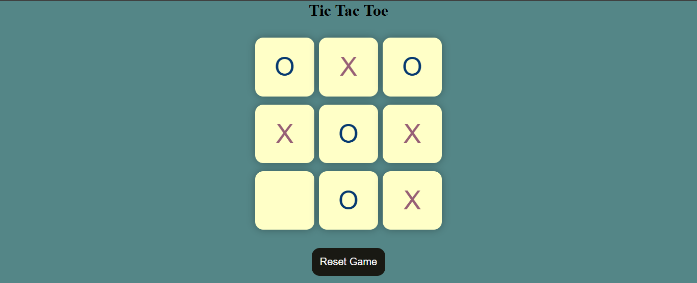

# 🎮 Tic Tac Toe Game

A fun and interactive *Tic Tac Toe* game built using *HTML, **CSS, and **JavaScript*. Play against a friend in this classic 2-player game with a clean and responsive design.

---

## 📌 Table of Contents

- [Features](#-features)
- [Technologies Used](#-technologies-used)
- [File Structure](#-folder-structure)
- [How to Run](#-how-to-run)
- [Screenshot](#-screenshot)
- [Author](#-author)
- [License](#-license)

---

## 🚀 Features

- 🧠 Classic 2-player Tic Tac Toe gameplay
- 🖱 Click-based move handling
- ✅ Win and draw detection
- 🔄 "Restart Game" button
- 📱 Responsive design for desktop and mobile
- showing Result

---

## 🛠 Technologies Used

- *HTML5* – Markup structure
- *CSS3* – Layout and gameboard styling
- *JavaScript* – Game logic and interactions

---

## 📁 File Structure

|  FILE NAME          | Description                              |
|---------------------|------------------------------------------|
| Tic Tac Toe.html    | #HTML file for the structure             |
| Tic Tac Toe.css     | #CSS file for the style and effects      |
| Tic Tac Toe.js      | #javascript file for the logic           | 

---

## ⚙ How to Run

Anyone can run this project easily by following these steps:

1. *Download or fork this repository*
   - Click the green Code button above and select *Download ZIP, or click **Fork* to clone it

2. *Open the folder*
   - Inside the folder, find the tic Tac Toe.html file

3. *Copy and paste the code*
   - Open the Tic Tac Toe.html file
   - Copy the code from it
   - Paste it into your *VS Code* or any code editor you're using
   - Save the file and open it in your browser

✅ Enjoy playing Tic Tac Toe right in your browser!

---

## 📸 Screenshot

Here is a preview of the game:

---

## 🙋‍♂ Author

*Muhammad Umar Hassan*  
- 📚 BSCS Student | Frontend Learner  
- 🔗 https://www.linkedin.com/in/m-umarh
- 📧 mumarh135@gmail.com 

---

## 📄 License

This project is licensed under the *MIT License*.

Feel free to use, share, and improve it!

---

## ⭐ Show Your Support

If you like this project:

- ⭐ Star this repository  
- 🍴 Fork it  
- 🧑‍💻 Share it with others

Thanks for playing!

